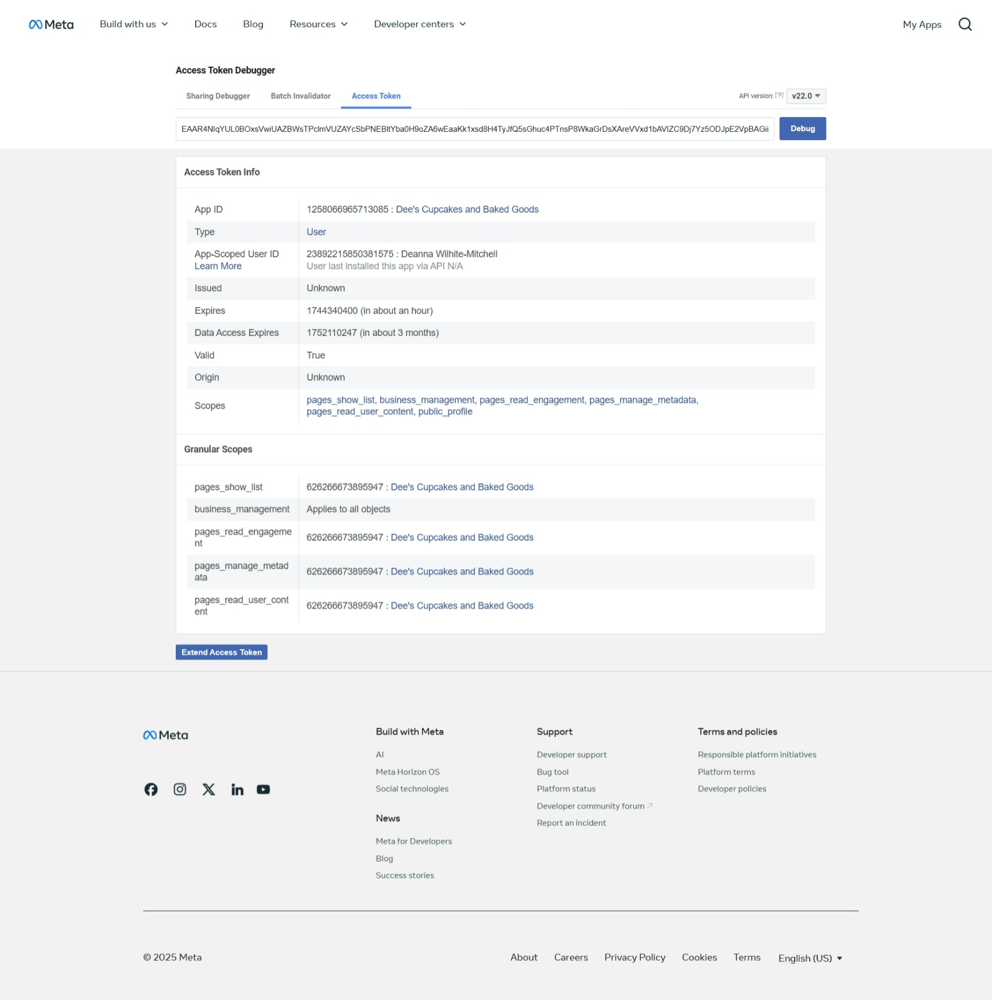
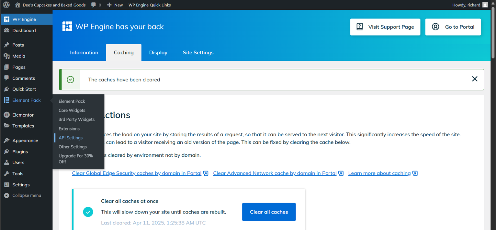

# WordPress Troubleshooting Instructions

## Issue # 1: Error validating access token for Facebook feed

### Error description

### Resolution steps
1. Log into [developers.facebook.com](https://developers.facebook.com) using the Facebook credentials used when initially creating the access token, which should also be the Facebook user that the website is connected to.
2. Select 'My Apps'.
3. Select 'Tools > Graph API Explorer'.

4. Next to the existing access token, select the info icon (blue circle with 'i') and then select 'Open in Access Token Tool'.

5. At the bottom of the page, select the 'Extend Access Token' option.

6. Enter your Facebook password again when prompted.

7. Copy the access token code at the bottom.

8. Armed with your new access token, log into the WordPress admin dashboard, located at '[your domain]/wp-admin'.

9. In the admin dashboard, select 'API Settings' from the 'Element Pack' menu.

 API Settings menu item' />

10. Under 'Facebook Social Access', replace the existing 'Facebook Access Token' with the one you copied in step 7, then select 'Save Settings'.

11. At this point, you've resolved the issue, but depending on the caching settings for you site, you may need to clear those caches or wait for them to refresh, which could take over 24 hours. For WP Engine, you can select the 'Quick clear all caches' option from the 'WP Engine Quick Links' within the WordPress admin dashboard.

